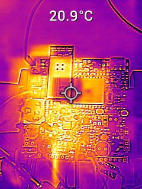

# a14g-final-submission

    * Team Number: T23
    * Team Name: Good Night
    * Team Members: Haichao Zhao, Zeng Li
    * Github Repository URL: https://github.com/ese5160/a14g-final-submission-s25-t23-good-night
    * Description of test hardware: (development boards, sensors, actuators, laptop + OS, etc) SAMW25, laptop

## 1. Video Presentation

The link to video presentation: [Video Presentation](https://drive.google.com/file/d/199g08DGVsTHXfeQyzWboZk-IfXS3VhQH/view?usp=sharing)

## 2. Project Summary
- Device Description
> We designed a desk electronic car with multiple functions to entertain users within boring working days. It can be controlled by anyone's voice command and task buttons in the web UI.

> What inspired you to do the project? What problem is your device solving?
>> In our daily life, we usually have to sit in the front of desks for multiple hours and sometimes we need to take a break and have some entertainment to make our life more interesting.
>
>> So in order to provide some ways to relax, we designed this desk electronic car. It will accompany with you and interact with you via your voice. Moreover, it can remaind you to take a break by showing LCD animation and led show. Users can play with it to command it to move around.

> How do you use the Internet to augment your device functionality?
>> We use Claude and chatGPT to give us some advice about chip selection and create some helpful code library.

- Device Functionality
> We use WINC1500 chip to do wifi connection and communicate with our MCU. In order to download firmware over the air, we created a virtual machine and uplode our new firmware. MCU can connect to wifi via wifi module and download the new firmware in the VM website and store it in the bootloader. Besides, we use node-red to remotely control our device via MQTT protocal.

> **Sensors:**
>> IMU
>>
>> Microphone
> 
> **Actuators:**
>> LCD
>>
>> Speaker
>>
>> Motor
>
> **Other modules:**
>> 5V module

> Block diagram
> 

- Challenges
> The first great challenge we met is about our 5V power module in our PCBA. The output voltage of 5V module was near 0. So in the end, we chose to desolder the jumpers for the 5V boost and used an individual 5V module and it works.
>
> The second challenge was we connected VSUB net with 5V net directly, which might lead to 5V power supply conflict. So in order to avoid this potential issue, we cut off the copper trace in the PCBA and using fly wire to reconnect the pins between our FTDI chip and power regulator chip. But soldering the fly wires was realy a time-cost and painful process. Luckily, we finished that.
>
> The third challenge is to integrate our individual functions together in FreeRTOS. During the integration process, we found count down time function and health remainder function had a serious conflict and wifi task needed a vary large heap to run successfully. After one whole day debugging, we still cannot integrate the count down time and health remainder together. So we had to give up the count down time function. For the wifi heap allocation, we tried to give smaller heap for each task and give more heap space for wifi. And ultimately, it works.

- Prototype Learnings
> The lessons I have learned from building and testing our prototype:
>> Firstly, deviding VUSB net from 5V boost output net.
>>
>> Secondly, always double even trible check the components to make sure their standard running voltage and current and power.
>>
>> Thirdly, when choosing LED strip, I need to figure out whether the MCU can provide the clock freqency required by the LED strip.

> What would you do differently if you had to build this device again?
> 
> I will definitely check my key components standard working condition such as inductors used for power regulator. And split the VUSB with 5V net.
 
- Next Steps & Takeaways
> What steps are needed to finish or improve this project?
>> We need to improve our UI display to show IMU data and configure our RTC initial time via Node-Red rather than software setup. Beside we need to add a distance sensor to detect the surrounding item in order to avoid falling from high altitude.

> What did you learn in ESE5160 through the lectures, assignments, and this course-long prototyping project?
>> Lots of things, including:
>> - Altium Designer using
>> - The procedure of PCBA designing
>> - PCBA test procedure
>> - Advanced soldering skills
>> - Professional device using: scrimper, e-load, temperature test gun, etc.
>> - MQTT based IOT controlling.
>> - Node-Red using
>> - OTAFU implementing
>> - FreeRTOS utilizing
>> - etc

- Project Links
> [URL to your Node-RED instance for our review ](http://172.177.231.136:1880/ui/#!/0?socketid=XXV4ffUuj0cg4lLcAAEU)

> [The share link to your final PCBA on Altium 365.](https://upenn-eselabs.365.altium.com/designs/7828C69B-F65F-46A7-A406-FC1A5B1ED7EE)

## 3. Hardware & Software Requirements

**Pass**:

- [√] Design Review Criteria

**Fail**:

- [ ] Design Review Criteria

### For Hardware Requirements

- [√] Project shall be based on SAMW25 microcontroller.

- [√] A 39x41x3.3mm OLED shall be used as user interface.

- [√] The Electronic Pet shall move around with wheels controlled by PWM signals(≥20kHz frequency).

- [√] The project shall utilize a microphone to capture users' voice command.

[Voice Control]()

- [√] The project shall utilize a speaker to play audio signals.

[Audio]()

- [√] The Electronic Pet shall have colorful lightning effect by using led strips based on I/O pins sending color data.

- [√] The Electronic Pet shall using 1-cell Li-Po battery with normal voltage 3.7V to power itself.

- [ ] The Elctronic Pet shall have a hardware audio weak-up button to activate voice detection functionality.

(But for this one, we can weak-up audio by using voice command)

[Weak-up audio]()

- [√] The Elctronic Pet shall have a switch to allow firmware downloaded between MCU and AI voice module.

- [√] The Elctronic Pet shall have a reset button to reset MCU.

### For Software Requirements

- [√] The OLED shall show real time clock with time changing animation under idle mode.

[Real Time Clock]()

- [√] The Electronic Pet shall count down time, set by users' voice command(all voice ommand response time ≤100ms and all voice recognition accuracy ≥95%).

[Voice Contorl Count Down Time]()

- [√] The OLED shall show time counting down changing animation.

[Count Down Time Changing Animation]()

- [√] The project shall control LED strip to display several modes: blinking with one color in 0.5 milisecond period, holding in one color, holding in multiple colors.

[Three LED Mode]()

- [√] The Electronic Pet shall move forward, move backward, turn left and turn right based on users' voice command or mobile application control.

[Motor Control Based on Voice Command and Node-RED]()

- [√] The Electronic Pet shall remind users to take breaks (OLED displaying animation for 10 seconds) and play a light show when 30 minutes counting down ends. (For test, we set time to 60 seconds)

[Health Reminder]()

- [√] The Electronic Pet shall recognize and answer users' voice commands in 3 seconds after recieving voice activation commands.

- [√] The OLED display shall communicate with MCU via SPI bus(≥10MHz) and display refresh rate ≥30fps.

- [√] The microphone shall send signals to AI module via I2S bus(Audio sampling rate ≥44.1kHz).

- [√] The speaker shall communicate with AI module via PWM/DAC signals.

## 4. Project Photos & Screenshots
- Final project, including any casework or interfacing elements that make up the full project (3D prints, screens, buttons, etc)

- The standalone PCBA, top

- The standalone PCBA, bottom

- Thermal camera images while the board is running under load 

- The Altium Board design in 2D view (screenshot)

- The Altium Board design in 3D view (screenshot)

- Node-RED dashboard (screenshot)

- Node-RED backend (screenshot)

- Block diagram of your system 

## Codebase

<<<<<<< HEAD
- A link to your final embedded C firmware codebases
- [Link to your Node-RED dashboard code](node_red.json)
=======
- A link to your final embedded C firmware codebases []
- A link to your Node-RED dashboard code
>>>>>>> fdd9c6e99c82528170548fd05b2809af31a465e1
- Links to any other software required for the functionality of your device

